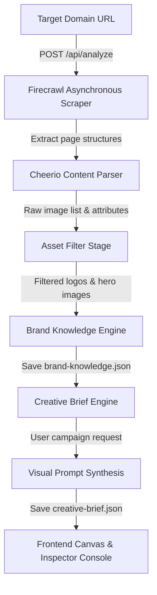

# Implementation Summary: Brand Ingestion & Creative Brief Pipeline

This document outlines the architecture and features implemented in the Next.js + TypeScript project to scan brand websites, filter high-value visual assets, synthesize company intelligence, and generate Creative Brief campaign instructions.

---

## 🛠 Project Architecture

The pipeline consists of four modular, sequential layers:

---

## 🚀 Key Modules Implemented

### 1. Phase 1: Real-Time Crawling Scraper
* **Asynchronous Execution**: Integrates the official **Firecrawl SDK** using `startCrawl` to instantly yield job IDs, eliminating browser request timeouts.
* **Progress Checkmark Synchronization**: The frontend hooks poll the `/api/analyze/status` endpoint to sync checklist items (*Crawling Homepage*, *Crawling About*, *Crawling Products*, etc.) in real time as scraping updates occur on the backend.
* **Client-Side Timeout Guard**: An `AbortController` timeout clears connections after 45 seconds to prevent client-side state freezes during server restarts or network interruptions.

### 2. Asset Filtering Stage
* **Logo Detection**: Extracts and scores logo candidates using container tags, IDs, class rules, and filenames (Dark Logo → Light Logo → SVG → PNG → Favicon). Inline SVGs are serialized to Data URIs. It selects a maximum of 2 logo variants.
* **Hero Image Classification**: Discards minor icons, background textures, client logos, tracking pixels, and images below $250\times250$ pixels. It scores and selects up to 8 high-resolution homepage product mockups, dashboards, and editorial graphics.
* **Deduplication**: Removes visual duplicates by path normalization and filename hashes.

### 3. Phase 2: Brand Knowledge Engine
* **Modular Gemini Pipeline**: Runs a modular analysis on the crawled markdown content using **Gemini 2.0/2.5 Flash** (JSON mode):
  * **Company Profile**: Business model, industry, description, and services list.
  * **Target Audience**: Primary/secondary demographics, objectives, and pain points.
  * **Voice & Tone**: Persona, keywords, emotional stance, and guidelines.
  * **Visual Guidelines**: whitespace usage, mood, imagery, and compositions.
* **Stand-Alone Persistence**: Saves structured JSON reports in `brand-knowledge/${companyName}-brand-knowledge.json` for reuse in downstream generators.
* **Fallback Strategy**: Automatically maps mock profiles if Gemini keys are missing to avoid breaking client-side execution.

### 4. Phase 3: Creative Brief Engine
* **User Campaign Directives**: Responds to user request prompts (e.g. *"Create a LinkedIn hiring post"*) typed into the Chat Console by calling `POST /api/creative-brief`.
* **Strategy brief Synthesis**: Generates Visual style, Layout grids, focal assets, color/typography rules, and CTAs.
* **Visual Prompt Synthesis**: Translates the visual strategy into a descriptive text prompt for image generation, stored directly inside the brief JSON.
* **Resilient Model Routing**: Requests **`gemini-2.5-flash-lite`** (high quota limits) and automatically falls back to **`gemini-2.5-flash`** if the Lite model is congested or unavailable.
* **Stand-Alone Persistence**: Saves files in `brand-knowledge/${companyName}-creative-brief.json`.

---

## 🎨 UI Ingestion Mappings

* **AI Inspector console**: Shows Collapsible Accordions:
  * **Brand Intelligence**: Real-time business profiles, tone, and audience.
  * **Swatches**: Live primary, accent, and background color codes.
  * **Detected Assets**: Displays extracted logo files and homepage visual hero assets.
  * **Campaign Creative Brief (New)**: Displays layout structures, CTAs, objectives, and target platforms.
  * **Generated Prompt**: Formats and displays the visual prompt in JSON format.
* **Interactive Canvas**: Selecting different campaign directives updates target platforms, CTA buttons, visual backgrounds (swapping mockups, logos, or hero imagery), and captions.
